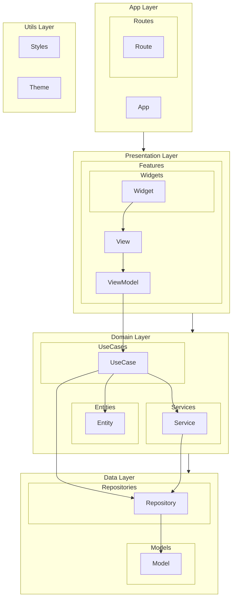

# 1. Project Overview

## 프로젝트 이름

## 핵심 가치 제안

## 주요 목표

## 차별화 포인트

# 2. Core functionalities

# 3. References & Docs

# 4. Project structure

각 기능별 폴더는 MVVM 패턴에 따라 View, ViewModel, 관련 Widget들을 포함합니다.

## Flutter Frontend 기본 코드 구조 (lib 내부)

- app/: 앱의 진입점과 라우팅 설정
- data/: 데이터 계층 (Repository, Model)
- domain/: 비즈니스 로직 (Service, UseCase, Entity)
- presentation/: UI 계층 (View, ViewModel, Widget)
- utils/: 유틸리티 클래스와 상수
  ─ styles/: 스타일 관련 파일
  - theme/: 앱 테마 설정
- config/: 상수 값과 환경 변수. firebase_options.dart
- main.dart: 앱의 진입점

## 외부 폴더 (lib 외부)

- assets/: 이미지, 아이콘, 폰트 등 정적 리소스
- firebase/: Firebase 관련 설정, 참고 파일
- docs/: 문서 파일. Cursor에서 참고하세요
- .cursorrules: Cursor Rules

## 4.1 Package Diagram

